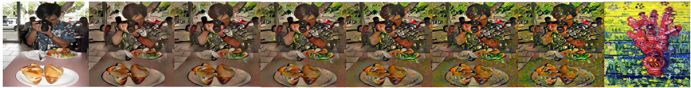

# Realtime style transfer
My implementation of [Arbitrary Style Transfer in Real-time with Adaptive Instance Normalization](https://arxiv.org/abs/1703.06868)

## Train

1. Place the style image in `img` directory (Default is `starry_night.jpg`)
2. make `data/content` and `data/style` directory
3. Place content images in `data/content` and style images in `data/style` directory
4. Run `python src/train.py`

## Test
`python src/test.py [WEIGHT_FILE] [CONTENT_IMAGE] [STYLE_IMAGE]`

I provide the trained weight of the decoder network in "weights/good.w"

## Result

The leftmost image is the content image, and the rightmost image is the style image.
These between images are stylized images alpha=0.0, 0.2, 0.4, 0.6, 0.8, 1.0 from left to right.

## Requirements
- Python (>= 3.6)
- Pytorch (1.5.0)
- Pillow
- Numpy